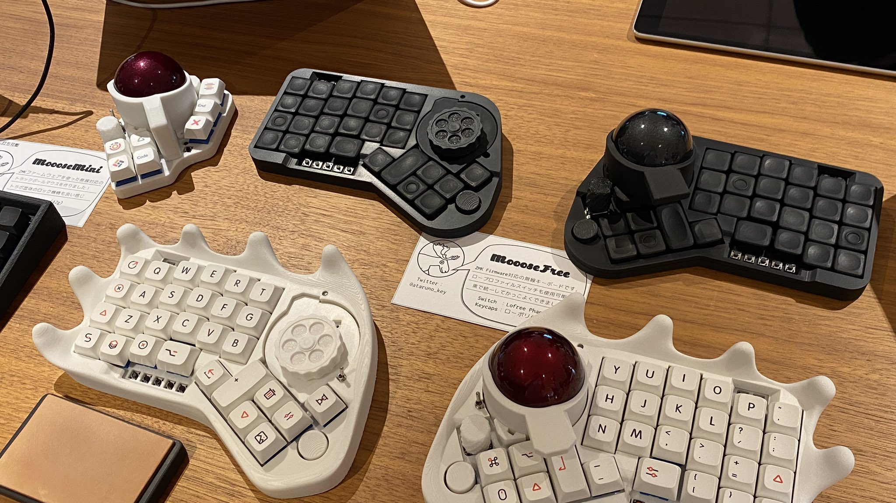

 

# MoooseFree
人差し指操作型55mm大玉トラックボール左右分割自作キーボード"MoooseFree"のプロジェクトリポジトリです。
※画像は開発中の物であり、製品版とはわずかに外観が異なる可能性があります。  

## 特徴
* ZMK Firmware採用で有線/無線可能  
* ZMK Studio対応  
* ロータリーエンコーダ対応  
* 55mmトラックボールもキットに同梱予定  
* ロック機能付きトラボ筐体  
* MX互換/ロープロファイルの両対応
* キーマップ設定可能なキー数はかなりたくさん
  * MX互換orロープロファイル 最大58キー(左右29キーずつ)
  * タクトスイッチ16キー(左右8キーずつ)
  * 4方向+プッシュスイッチ2つ(左右5キーずつ)

## 詳細
[販売ページ](https://ataruno.booth.pm/items/7044548)  
[プロジェクトページ](https://github.com/ataruno/MoooseFree/tree/main)  
[ビルドガイド(ハード)](https://github.com/ataruno/MoooseFree/blob/main/doc/build_guide_hard.md)  
[ビルドガイド(ソフト)](https://github.com/ataruno/MoooseFree/blob/main/doc/build_guide_soft.md)  

## 注意点
* ご自身ではんだ付けが必要な組み立てキットです。
* 本体ケースなどは家庭用3Dプリンターにて出力したものです。寸法公差、カケ、汚れなどがある場合があります。ご了承ください。(商品になると判断したものを在庫追加いたします。)
* 電源構成はご自身でご検討ください。仮にリチウムイオンバッテリーを使用する場合は取り扱いに十分に気を付けてください。  
  * 参考：https://www.baj.or.jp/battery/safety/safety16.html  
* 本キーボード自作キットを使用した際のいかなる損害についても、開発者は責任を負いかねます。

### FIRMWARE  
Special thanks to the people behind the ZMK project:  
- [Pete Johanson](https://github.com/petejohanson)  
- [Cem Aksoylar](https://github.com/caksoylar)  
- And all the [ZMK Contributors](https://github.com/zmkfirmware/zmk/graphs/contributors)  

